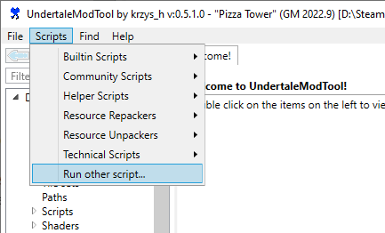
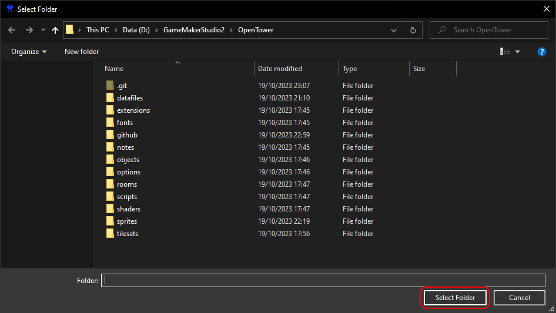

# Pizza Tower
- A full decompilation of Pizza Tower v1.1.2 (International Update).
- I am not affiliated with Tour De Pizza in any way.

# Requirements
- [Pizza Tower on Steam](https://store.steampowered.com/app/2231450/Pizza_Tower/)
- [GameMaker 2023.1.1.62](https://gms.yoyogames.com/GameMaker-Installer-2023.1.1.62.exe) 
- [Steamworks SDK](https://partner.steamgames.com/downloads/steamworks_sdk.zip)  
This one's optional if you're gonna remove it, which you need to for mods

This repository doesn't include any of the datafiles (FMOD, langs) or sprites. An [UndertaleModTool](https://github.com/krzys-h/UndertaleModTool/releases) script is included to extract everything needed from the `data.win`, and port the required files to the decomp folder.

# The Script

1. Make sure Pizza Tower is up to date, and open its `data.win` file in UndertaleModTool. Open the "Scripts" tab at the top of the window, and select "Run other script..."

2. Go to the decomp's folder, and select the `PTdecompiler.csx` file.

3. The script will ask you to select a folder. Select the decomp folder.

4. It takes a while to dump every frame of every sprite. Give it about 15 minutes... Make sure it dumps this to the same folder the YYP file is located.
5. Run the `PizzaTower_GM2.yyp` in the *right version of GameMaker*. Open Extensions > Steamworks and change the "Steam SDK" location to wherever you put your Steamworks SDK. If that doesn't work, try going INTO the Steamworks folder and make that the path instead. 

**If you try building the game with Steamworks, it will just run the unmodded game.** You can always just remove the extension though. Look through all Steam related code, and comment out any use of the `steam_` functions. I think you can also just delete the `steam_api64.dll` file from the build.

# Upgrading GameMaker

If you want to move to a future GameMaker version you'll need to make some changes.

1. Remove Steamworks and all code associated with it, unless you're gonna do some weird Pizza Oven stuff.
2. New IDE versions tend to re-order and move things around, making stuff run in a different order. This breaks warps, parallax, the camera, menus... Make a controller object that runs object's step events in the correct order.
3. Whenever text is drawn to the screen, offset it by the font's sprite origin, as horrible as that might sound. You can hook into the `draw_text` functions with some macro shenanigans.
4. Rename the `string_split` function to something else, it's reserved now. CTRL+SHIFT+F to mass replace.
5. Probably more. I forgot. If you got this far you can figure out the rest anyway.
